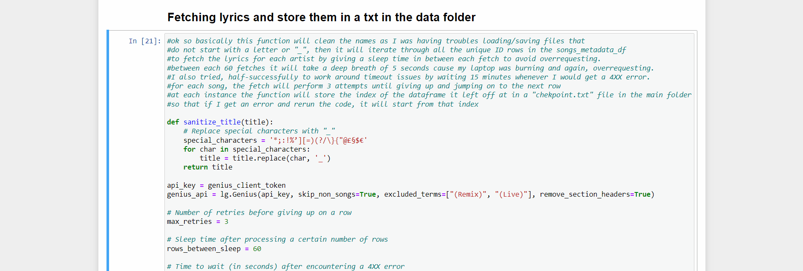
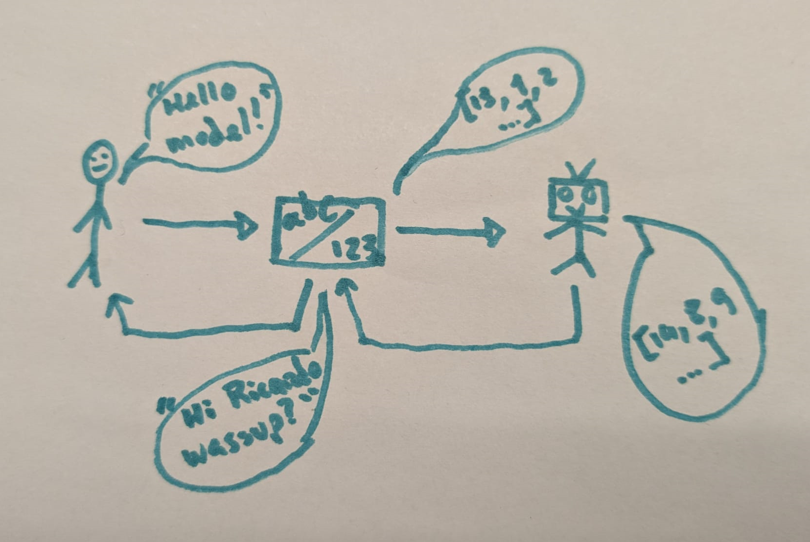
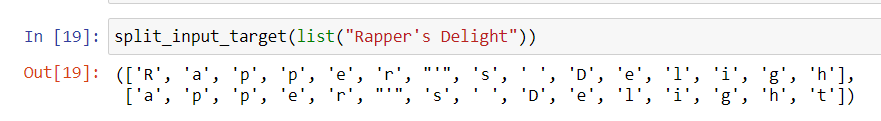
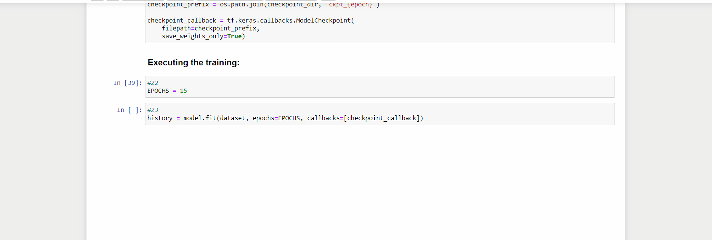
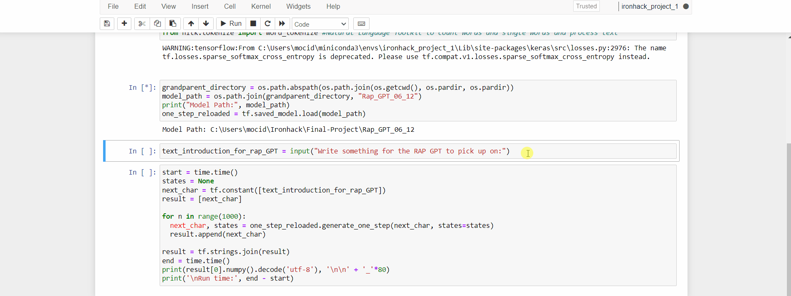

# RAP GPT - a RNN model to generate rap lyrics

## Goal

Creating a Natural Language Processing (NLP) Machine Learning (ML) model using Recurrent Neural Networks (RNN) capable of extending existing lyrics to a rap song by following the same logic of the previous ones, with new lines of text provided by the user. BONUS: visualizations on rapper's vocabulary extension.

## Extensive Process 

### **The libraries used across the project:**

- **os** - this library allows us to interact with the operative system. In our case it was used several times to access files in specific folders (the "data" folder for example) and to iterate through those files. Also to build paths to create new .txts (for example the compilation of all the lyrics)
- **dotenv** - where we've used imported *load_dotenv* to hide credentials for the Genius API
- **tensorflow** - created by the BRAIN Team at Google, it was the main pilar for the creation of our RNN
- **keras** - acts as an API, running on top TensorFlow
- **numpy** - we've used NumPy in the construction and instruction of our RNN model
- **time** - mostly used to avoid/workaround API limitations when requesting lyrics to lyricsgenius (that scrapes the Genius API)
- **lyricsgenius** - instead of using the Genius API directly to fetch lyrics, we've used the lyricsgenius library
- **requests** - to collect metadata for the songs of each artist and send http requests to the Genius API and to lyricsgenius
- **json** - we've used JSON to store metadata for songs
- **pandas** - broadly used across the several phases mostly in the creation and management of dataframes
- **requests.exceptions (SSLError)** - as a workaround to bad requests to the lyricsgenius library
- **re** - [regular expressions] we've used this library to manage special characters in artists' names where the name could be a potential issue in the management of information ("A$AP Rocky" for example)
- **logging** - this was used while fetching lyrics from the lyricsgenius library as a way to avoid starting from scratch whenever the code would face an error.
- **nltk** - [natural language tool kit] while managing the content of the lyrics for each artist
- **nltk.corpus (stopwords)** - to define what words _not_ to count for statistics
- **from nltk.corpus (words)** - to check whether the words in the lyrics actually exist in the english dictionary and avoid "made-up" words by artists
- **collections (Counter)** - as a way to interact with the content of the .txt files to count words
- **string** - this library helps us cleaning the lyrics to account only for characters based words and keep "400$" for example out

### **1. Data collection and cleaning** 
    
 *1.1 Collecting and cleaning songs metadata* 

This project makes use of the [Genius API](https://docs.genius.com/#annotations-h2). I set up a Genius account in their page to be able to retrieve the fundamental pieces to access their API [CLIENT_ID, CLIENT_SECRET and CLIENT_ACCESS_TOKEN]. These information is, for a matter of privacy, stored in a .env file which is accessed via a load_dotenv() function imported from the load_dotenv library.

I've set 4 functions to automate the retrieval and cleaning process of *metadata* for artists' songs.

    - clean_artist_name(artist_name)
This function handles artist's names that contain numbers or special characters as this is an issue for the subsequent functions. Given the example of the artist Lil’ Kim, the graphic ’ would be converted into an "_" (Lil _ Kim)

    BASE_URL = "https://api.genius.com"
    DATA_FOLDER = "data"
    _get(path, params=None, headers=None)
This function sends an http get request to our genius API based on a url that we've built.

    get_artist_songs(artist_name)
A function to identify the artists songs in Genius. Each song as a unique ID and this is a mapping to each artist's songs library.

    get_song_information(song_ids, artist_name)
Retrieves information about each song given a list of song IDs.

    get_tracks_info_for_artist(artist_name)
This function encapsulates the previous steps and works as an orchestrator to the data collection. It sends the https request, collects the metadata and finally dumps it into a JSON file in our "data" folder as well as a .txt with the tracklist (comprised of unique IDs) for each artist. In the given example it would create:

- Lil_ Kim Songs.json
- Lil_ Kim Genius Song IDs.txt

A further function was created to automate some surface cleaning process, namely:

    load_json_and_clean(artist_name, data_folder="data", min_count_albums=6)
This function loads the dumped JSON file into a dictionary and converts it to a Dataframe named after the passed artist _Lil_Kim_df in the example. The dataframe is then subject to two cleaning processes:

- Every row where the album count was <6 was dropped
- Every row where the album column a <'single'> (meaning an isolated song, not pertaining to an album) was also dropped.

This decision was made based on the observations for some artists where the low album count represented participations in mixtapes for example but not the own artist's album. Similarly, for the purpose of data aggregation into albums and easier processing, I am working with albums exclusively, hence the singles drop.

Notice that both **get_tracks_info_for_artist** and **load_json_and_clean** require solely the passing of the artist's name. 
Another important note: the two cleaning functions were applied to assure some superficial cleaning but further cleaning would be required if we wanted to assure we're working exclusively with the artist's albums and not mixtape/compilations participations. This unfortunatelly would require some human ad-hoc filtering as there is not an automated/logical way to do so according to my knowledge and to the libraries and web pages I found to this date.

    
*1.2 Collecting the lyrics* 

We have now a dataframe with metadata for each artist. The songs_metadata_df consolidates all the cleaned dataframe via concatenation and has got a dedicated column to all the unique songs IDs. These IDs are the key to ask the API for the lyrics for each of them.
I am setting an additional 

    fetch_lyrics(genius_track_id)
function that iterates through the songs_metadata_df column with the songs unique IDs to fetch the corresponding lyrics. In the event the function is faced with an error, it will sleep for 5 minutes before moving to the next unique ID. 

At the end of this process, I will be consolidating every lyrics per artist and all the lyrics in one single file. This file will be pivotal in our learning process as this is going to be the "worbook" the model is going to learn from.

The dataset is comprised of lyrics for the following artists:
        
    (_21Savage + _50Cent + _ATribeCalledQuest + _A_APRocky + _AesopRock +_Atmosphere + _AzealiaBanks + _BabyKeem + _BigDaddyKane + _BigL +_BigPun + _BigSean + _CardiB + _ChanceTheRapper + _ChiefKeef +_ChildishGambino + _Common + _Cordae + _CypressHill + _DannyBrown +_DeLaSoul + _DMX + _DojaCat + _DrDre + _Drake + _EarlSweatshirt +_Eminem + _EricBRakim + _Future + _GhostfaceKillah + _GucciMane +_Hopsin + _IceCube + _IceSpice + _JCole + _JackHarlow + _JAYZ +_Jeezy + _JoeyBadass + _JoynerLucas + _JuiceWRLD + _KanyeWest +_KendrickLamar + _KidCudi + _KMD + _LaurynHill + _LilNasX +_LilUziVert + _LilWayne + _LilYachty + _LilKim + _Logic +_LupeFiasco + _MacMiller + _MastaAce + _MeganTheeStallion +_MFDOOM + _Migos + _MissyElliott + _MobbDeep + _Nas + _NipseyHussle +_OutKast + _PlayboiCarti + _PopSmoke + _PublicEnemy + _PushaT +_QueenLatifah + _RunDMC + _Scarface + _SlickRick + _SnoopDogg +_TalibKweli + _TheNotoriousBIG + _ThePharcyde + _TravisScott +_VinceStaples + _WuTangClan + _YasiinBey + _YoungThug)

### 2. **Building the model** 

    
2.1 *Feeding the model and having it processing its food* 

    # Read, then decode for py2 compat.
    text = open(path_to_file, 'rb').read().decode(encoding='utf-8')

_Length of text: 286036 characters_

First thing to notice is - in the end, I used only a fragment of the compiled lyrics, the reason for it is mostly processing power as the original compilation file with all the ca. 13000 .txt files was comprised of around 35M characters. Another reason is - I ended up using just the lyrics for one artist to provide the model with some sort of coherence/consistency across the learning, as different artists have different flows, styles and bars lenght.

During this process, we also code the characters, this means that we are not telling the model "Hello model!" but rather a sequence of numbers representing the characters associated to it:

Just like with a machine learning model, our Rap GPT takes some set that's to be split into training and test. This is accomplished with sequences, where in each sequence there is an input and a target. We managed to have the model breaking sequences so as to interpret patterns in the coded characters and predict the next one:

Notice how the sequence "Rapper's delight" was broken into:

- **input**: "Rapper's deligh"
- **target**: "apper's delight"

*2.2 Training the model* 

        BATCH_SIZE = 64
        BUFFER_SIZE = 10000

        dataset = (
            dataset
            .shuffle(BUFFER_SIZE)
            .batch(BATCH_SIZE, drop_remainder=True)
            .prefetch(tf.data.experimental.AUTOTUNE))

The model will be **prefecthing** batches of data, allowing it to overlap the training of one batch with the preprocessing of the next.

The **.batch**(BATCH_SIZE, drop_remainder=True) operation creates batches of the shuffled dataset, where each batch contains BATCH_SIZE sequences. The drop_remainder=True argument indicates that any remaining sequences that cannot form a complete batch will be dropped.

The **.shuffle**(BUFFER_SIZE) operation shuffles the elements of the dataset. The BUFFER_SIZE parameter specifies the number of elements from the dataset to maintain in a buffer for efficient shuffling. This is particularly useful when dealing with large datasets that cannot fit into memory. Shuffling is important so that our model doesn't see the same order of sequences every time it learns.

*2.2.1 The model's layers* 

**tf.keras.layers.Embedding**: The input layer. A trainable lookup table that will map each character-ID to a vector with embedding_dim dimensions. In other words: This layer is like looking up each word in our dictionary and getting a special code for it. This code is a unique set of numbers that helps the computer understand each word. = _Coding the word / Understanding" module_

**tf.keras.layers.GRU** (Gated Recurrent Unit): A type of RNN with size units=rnn_units (You can also use an LSTM layer here.) In other words: This layer is like a storyteller that remembers the important parts of the story and predicts what happens next based on what it remembers. It's good at capturing the context and relationships between different parts of the story. = _Predicting / Creativity_

**tf.keras.layers.Dense**: The output layer, with vocab_size outputs. It outputs one logit for each character in the vocabulary. These are the log-likelihood of each character according to the model. In other words: this layer is like making a decision. It looks at all the possibilities and decides which word should come next. It assigns a score to each word, and the word with the highest score is the chosen one. = _deciding the output / Writer_

*2.2.2 EPOCHs, loss factor and optimizer* 

**EPOCHs** - at each completion of all the iterations through all the batched sequences, we complete an EPOCH. At each EPOCH, up to a level, the model is learning better what it learned. I ran 30 EPOCHs until I minimized the **loss factor**:

**(Adam) Optimizer** - Let's make a paralelism with a robot that's learning how to cook - This is like telling the robot how to adjust the amount of each ingredient based on how the dish tastes. Adam is a smart chef that fine-tunes the recipe as it goes, making sure it gets better with each attempt. The optimizer is responsible for updating the model's weights based on the calculated gradients during backpropagation. Adam is an adaptive optimization algorithm that adjusts learning rates for each parameter individually.

**Loss Function** - The loss function is a measure of how well your model is performing. in other words: This is like the taste tester who gives feedback to the robot. The robot tries different versions of the recipe, and the taste tester (loss function) says how good or bad each version is. For the rap lyrics, it's like saying how well the generated lyrics match the desired style.

*2.2.3 Curriculum learning* 
        
    class CustomTraining(MyModel):
        @tf.function
        def train_step(self, inputs):
            inputs, labels = inputs
            with tf.GradientTape() as tape:
                predictions = self(inputs, training=True)
                loss = self.loss(labels, predictions)
            grads = tape.gradient(loss, model.trainable_variables)
            self.optimizer.apply_gradients(zip(grads, model.trainable_variables))

            return {'loss': loss}

We can have the model learning from it's own mistakes. This is a curriculum learning version of the model where:

The **train_step function** is like a coach talking to the model after each move, telling it what it did well and what it needs to improve. The model then adjusts itself based on this feedback. Notice the loss parameter that we've created previously and that is the degree to what extent the model is accurate (the one we're bringing down at each EPOCH).

The **CustomTraining class** is a special way to train the model, giving us more control over how it learns. It's like having a training program where we decide how the model should improve, rather than just following a fixed set of instructions. This is where we have defined the number of neurons in our network for example.

## The Rap Generation 

Even though some more training is on the way also twaking some paramters like the number of Gated Recurrent Units, the embedding space, the number of RNN units and the dataset itself as well as the number of EPOCHs, the model performed reasonably in giving us a hint of what a RAP GPT can do. I asked the user to input a one liner the model can pickup up on and for:

- 10 EPOCHS (with curriculum learning)
- vocab_size = len(ids_from_chars.get_vocabulary())
- embedding_dim = 510
- rnn_units = 1550

it performed as such:

## External links 

[Link to Tableau](https://public.tableau.com/app/profile/ricardo.beato/viz/Rapanalysis/Dashboard1?publish=yes) - I've additionally digested the compiled lyrics to find who the most lyrically gifted rapper was in my dataset

I'm a rapper and instrumental producer myself!
[Why don't you follow me here?](https://www.youtube.com/@BlessedRich.)

## Resources and learning materials 

1. [Setting up the Genius API](https://towardsdatascience.com/song-lyrics-genius-api-dcc2819c29)
2. [Genius API](https://docs.genius.com/)
3. [What is TensorFlow?](https://www.youtube.com/watch?v=9NsfX9W80rw)
    
    3.1 [What are EPOCHs and Batches?](https://www.youtube.com/watch?v=BvqerWSp1_s)
4. [What are RNN?](https://www.youtube.com/watch?v=AsNTP8Kwu80&t=206s)
5. Previous relevant projects on the same topic:
    
    5.1 [Metadata extraction from Genius' API](https://gist.github.com/imdkm/a60247b59ff1881fa4bb8846a9b44c96)
    
    5.2 ["The Largest Vocabulary In Hip Hop"](https://pudding.cool/projects/vocabulary/index.html)
    
    5.3 ["An analysis of Hip Hop songs with Machine Learning and AI"](https://towardsdatascience.com/using-machine-learning-and-ai-to-understand-hip-hop-songs-evolution-e819c2a5172d)

    https://pudding.cool/projects/vocabulary/index.html

## Glossary 

[**Tensors**](https://youtu.be/L35fFDpwIM4?si=u2Ov-IULhtX5mwwA&t=293) - a tensor is as a container that can hold different kinds of data, like numbers or strings. Think of it like a box that can store a single value, a line of values, a table of values, or even more complex structures. Tensors help organize and process information for the computer to understand and learn from.
    
- **Ragged Tensors** - these are tensors where different rows can have different lengths. In other words, it's like a table where each row can have a different number of elements. This is useful when dealing with sequences of varying lengths, like lines of the lyrics in the context of this project, that have different lengths.

[**EPOCH**](https://www.simplilearn.com/tutorials/machine-learning-tutorial/what-is-epoch-in-machine-learning) - Machine learning is a field where the learning aspect of Artificial Intelligence (AI) is the focus. This learning aspect is developed by algorithms that represent a set of data. Machine learning models are trained with specific datasets passed through the algorithm. 
Each time a dataset passes through an algorithm, it is said to have completed an epoch. Therefore, Epoch, in machine learning, refers to the one entire passing of training data through the algorithm. It's a hyperparameter that determines the process of training the machine learning model. The number of epochs is considered a hyperparameter. It defines the number of times the entire data set has to be worked through the learning algorithm. 

[**Iteration**](https://www.simplilearn.com/tutorials/machine-learning-tutorial/what-is-epoch-in-machine-learning) - The total number of batches required to complete one Epoch is called an iteration. The number of batches equals the total number of iterations for one Epoch. 

[**Batch**](https://www.simplilearn.com/tutorials/machine-learning-tutorial/what-is-epoch-in-machine-learning) - The batch is the dataset that has been divided into smaller parts to be fed into the algorithm. 

**Sequence** - in the context of this project, sequences will be the a consecutive series of characters (or their numerical representations) from the original text data. Each sequence is a subset of the original text, containing a fixed number of characters (determined by seq_length). Each sequence is used as input to the model, and the target for each sequence is the following character in the text. Sequences are organized into batches for efficient training, and each batch is processed in one iteration during training. A sequence will contain:
    
- an **input** - the string/sequence of integers representing the string which last character will not be present
- a **label** - stemming from the same sequence that originated the input but misplaced one unit to the right. 
- Practical example:
    
    - Sequence = "Rapper's delight"
    - Input = "Rapper's deligh"
    - Label = "apper's delight"

in other words, this is how we teach the model what's missing and what it should predict.

**Token** - In the context of natural language processing and machine learning, a "token" is a unit of text that has been extracted from a larger sequence. In our example, the running model will create words and tokenize them because it works in a numerical way. This numerical representation allows the model to learn patterns and relationships in the data more effectively.

**(songs)Metadata** - metadata refers, in this project, to the information collected for each artist's song and includes:
- *title*
- *album*
- *release_date*
- *featured_artists*
- *producer_artists*
- *writer_artists*
- *genius_track_id*
- *genius_album_id*

